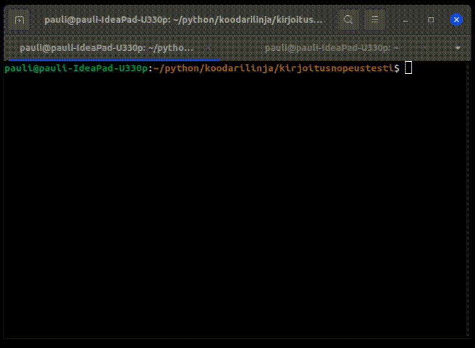

# Kirjoitusnopeuspeli

Seuraavaksi tavoite on tehdä kirjoitustarkkuutta ja nopeutta mittaava peli, jota voidaan pelata komentoriviltä. Pelissä annetaan lista sanoja, joita esitetään käyttäjälle satunnaisessa järjestyksessä. Pelaaja kirjoittaa hänelle esitetyn sanan.

Pelissä voi valita, kuinka monta sanaa pelaaja haluaa kirjoittaa. Kun annettu sanamäärä on täysi, ohjelma tulostaa raportin näytölle. Raportissa näkyy kuinka monta sanoista meni oikein ja kuinka monta väärin. Lisäksi peli laskee kirjoitusnopeuden, eli kuinka monta merkkiä käyttäjä on kirjoittanut minuutissa sekä kuinka monta sanaa käyttäjä kirjoittaa minuutissa (yksi sana on viisi merkkiä).

# Pelin toteuttaminen

Tehtävän suorittamisen helpottamiseksi olen palastellut ongelmaa osiin tehtävien muodossa. Suorittamalla alla olevia tehtäviä järjestyksessä, pääset vaihe vaiheelta lähemmäksi lopullista peliä.

# Tehtävä 1 - Sanojen kysyminen käyttäjältä

a) Luo lista, jossa on viisi sanaa. Voit keksiä sanat itse. Näitä sanoja käytetään, jotta ohjelman toiminta saadaan halutunlaiseksi. Sanat korvataan myöhemmin kattavammalla listalla.

b) Luo muuttuja, joka sisältää tiedon kuinka monta sanaa käyttäjän pyydetään kirjoittaa. Käytä tässä while-looppia. Tulosta näytölle satunnaisesti joku listan sanoista. **Toteuta tämä sillä tavalla, että sanalistan kokoa voi muuttaa ja silti kaikilla sanoilla on mahdollisuus tulostua näytölle!** Tämän suoritettuasi sinulla pitäisi näkyä näytöllä allekkain viisi sanaa, jotka ovat satunnaisesti valittu a-kohdassa kirjoittamastasi sanalistasta. **Huom! Kyse on satunnaisluvuista, jolloin sama sana voi näkyä useamman kerran.**

Tarvitset seuraavia asioita tehtävässä:
```python
import random

satunnaisluku = random.randint(0, 5) # Satunnaisluku nollan ja viiden väliltä

lista_sanoja = ['moi', 'hei', 'terve']
listan_pituus = len(lista_sanoja)
print(lista_sanoja[0]) # Tulostaa listan 1. alkion
print(lista_sanoja[listan_pituus - 1]) # Tulostaa listan viimeisen alkion
```

c) Luo tyhjä lista, johon tallennat käyttäjän kirjoittamat sanat. Kysy tulostettu sana käyttäjältä ja tallenna käyttäjän kirjoittama sana listaan. Tulosta ohjelman lopuksi listan sisältö.

d) Muokkaa toteutusta siten, että aina uuden sanan välissä komentorivi tyhjennetään. Näytöllä tulee näkyä siis vain yksi sana ja kohta, johon käyttäjä voi kirjoittaa sanan. Komentorivi voidaan tyhjentää ``clear``-komennolla (Windowsissa ``cls``). Pythonilla voit suorittaa komennon seuraavasti:

```python
import os
os.system('clear') # Linux
os.system('cls') # Windows
```

Lopullinen ohjelman suoritus näyttää tältä:



# Tehtävä 2 - Oikeinkirjoitettujen sanojen määrä

Tehtävänä on luoda funktio, joka laskee ja palauttaa oikein kirjoitettujen sanojen määrän. Funktio ottaa argumentikseen listan kirjoitettuja sanoja sekä listan, jossa ovat kaikki mahdolliset testissä olevat sanat.

Oikeinkirjoitus tutkitaan siten, että käydään käyttäjän kirjoittamat sanat läpi. Mikäli käyttäjän kirjoittama sana löytyy alkuperäisestä sanalistasta, on käyttäjä kirjoittanut sanan oikein. Muussa tapauksessa sana on kirjoitettu väärin.

Funktion tulee palauttaa oikeinkirjoitettujen sanojen määrä. Alla esimerkki testipääohjelmasta, jolla voit testata funktion toimintaa.

```python
kaikki_sanat = ['hei', 'moi', 'terve', 'kiitos']
kirjoitetut_sanat = ['moi', 'tevre', 'kiitos', 'moi', 'hhei']

oikeat_sanat = laske_oikeat_sanat(kaikki_sanat, kirjoitetut_sanat)
print(oikeat_sanat) # Tämä tulostaa 3
```

Tässä täytyy tutkia, onko joku tietty alkio toisessa listassa vai ei. Eräs tapa on käyttää Pythonin ``in``-avainsanaa, joka toimii seuraavasti.

```python
lukulista = [1, 2, 3, 4, 5]
numero = 3
toinen_numero = 8

print(numero in lukulista) # Tulostaa True
print(toinen_numero in lukulista) # Tulostaa False

# In-avainsanaa voidaan käyttää myös ehtolauseessa
if numero in lukulista:
    # Tee jotakin, jos numero löytyy listasta
```